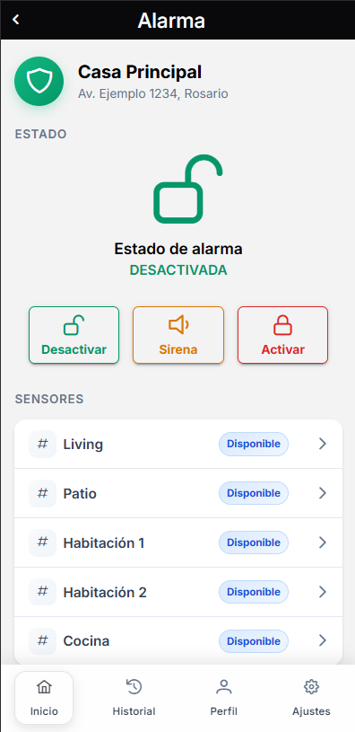
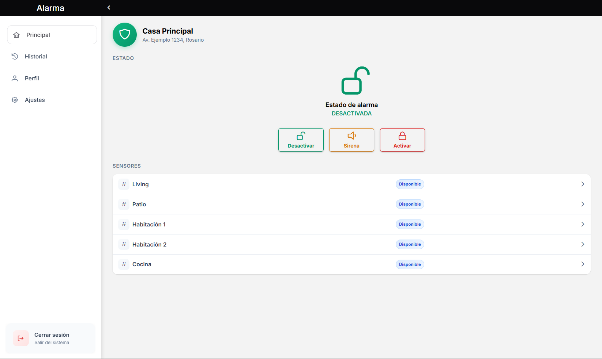
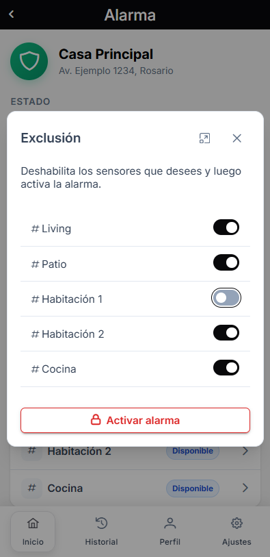
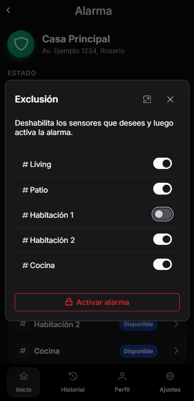
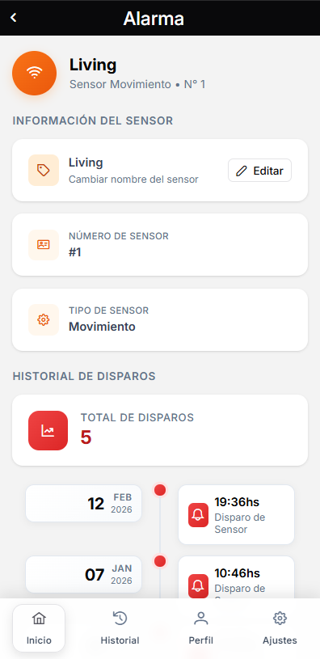
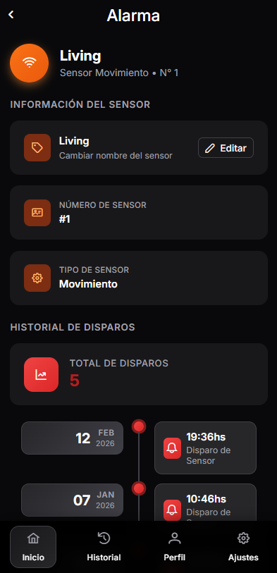

# Sistema de Alarmas — Frontend

Aplicación frontend para un **sistema de alarmas domóticas**, desarrollada con **Angular** y desplegable tanto como **aplicación web** como **app móvil** mediante Capacitor.

La aplicación permite a los usuarios **monitorear, controlar y configurar** sus sistemas de alarma en tiempo real desde una interfaz centralizada.

## Vista Previa

### Dashboard
<div align="center">
  
  
</div>

### Armado de alarma + Sensores
<div align="center">
  
  
  
  
</div>

## Acceso de demostración

URL: [alarmstech.vercel.app](https://alarmstech.vercel.app)

| Campo | Valor |
| --- | --- |
| Usuario | `demouser@example.com` |
| Contraseña | `Demouser` |

> *Algunas funcionalidades están restringidas para el usuario demo. Para probar todas las funcionalidades de la aplicación, podés crear y validar una cuenta propia.*

## Descripción General

Este proyecto forma parte de un **ecosistema full stack de alarmas inteligentes**, donde:

* El **frontend** se encarga de la interfaz y la experiencia de usuario
* El **backend** gestiona la lógica de negocio y persistencia
* Los dispositivos se comunican mediante **MQTT**
* Las actualizaciones en tiempo real se manejan con **WebSockets**

El sistema está diseñado con foco en la **escalabilidad, modularidad y mantenibilidad**.

## Funcionalidades Principales

* 🔐 Autenticación de usuarios (login / registro)
* 🏠 Gestión de múltiples hogares
* 🚨 Control del sistema de alarma (activar / desactivar)
* 📡 Actualizaciones en tiempo real
* 🔔 Notificaciones de eventos y alertas
* ⚙️ Configuración de dispositivos y sensores
* 📱 Soporte mobile mediante Capacitor

## Arquitectura

La aplicación sigue una **arquitectura basada en features**, con una clara separación de responsabilidades.

```
src/app/
│
├── auth/              → Funcionalidad de autenticación
├── dashboard/         → Aplicación principal (zona protegida)
├── shared/            → Componentes, servicios y utilidades reutilizables
```

### Principios Clave

* **Aislamiento por feature**
* **Patrón Component → Service**
* **Responsabilidad única por capa**
* **Reutilización de lógica común**
* **Estructura escalable**

## Stack Tecnológico

* **Angular 19**
* **TypeScript**
* **RxJS**
* **Socket.IO Client**
* **Capacitor**
* **SCSS**

## Comunicación en Tiempo Real

El frontend se integra con sistemas en tiempo real mediante:

* **WebSockets (Socket.IO)** → actualización de la UI
* **MQTT (a través del backend)** → comunicación con dispositivos

### Flujo típico

1. El usuario ejecuta una acción (ej: activar alarma)
2. Se envía un request HTTP al backend
3. El backend publica un mensaje MQTT
4. El dispositivo responde
5. El backend emite un evento por WebSocket
6. El frontend actualiza la interfaz en tiempo real

## Guía de Desarrollo

Estas guías definen las buenas prácticas y convenciones del proyecto.

### Reglas obligatorias

* Seguir el flujo **Component → Service → API**
* Colocar lógica reutilizable en `shared/`
* Mantener aisladas las features (`auth/`, `dashboard/`)
* Manejar asincronía con **RxJS**

### Restricciones

* Crear nuevas carpetas en el nivel raíz de `app/`
* Mezclar responsabilidades entre features
* Implementar lógica de negocio en componentes
* Generar efectos secundarios fuera de servicios

## Desarrollo Asistido por IA

El proyecto incluye soporte para desarrollo asistido mediante agentes de IA, definido en:

* `AGENTS.md`
* Carpeta `.opencode/skills/`

### Sistema de Skills

Se define un conjunto de **skills de desarrollo** para asegurar consistencia:

* API Communication
* Architecture Enforcement
* State Management
* Real-Time Communication
* Error Handling

Estas reglas garantizan que el código:

* Sea consistente con la arquitectura
* Evite anti-patrones
* Sea escalable

## Configuración de Entorno

La aplicación maneja los entornos mediante `fileReplacements` de Angular:

- `src/app/env.ts` → entorno de desarrollo (usado por `ng serve`)
- `src/app/env.prod.ts` → entorno de producción (usado por `ng build --configuration production`)

```ts
export const ENV = {
  API_URL: 'https://<TU_DOMINIO_O_IP>:<PUERTO>/api-alarma',
  SOCKET_URL: 'https://<TU_DOMINIO_O_IP>:<PUERTO>',
  WEB_APP_URL: 'https://<TU_DOMINIO>'
};
```

Las constantes que no dependen del entorno (ruta del socket, eventos WebSocket, etc.) viven en `src/app/shared/constants.ts`.

## Integración con Backend

Este frontend está diseñado para integrarse con un backend que incluye:

* API REST (Express + MongoDB)
* WebSockets (Socket.IO)
* Broker MQTT (Mosquitto)

## Mejoras Futuras

* 📊 Dashboard con analíticas avanzadas
* 🔔 Notificaciones push
* 🌐 Soporte multi-idioma
* 🎨 Mejoras de UI/UX

## Autor

**Diego Salvañá**

*Desarrollador Frontend / Full Stack*
